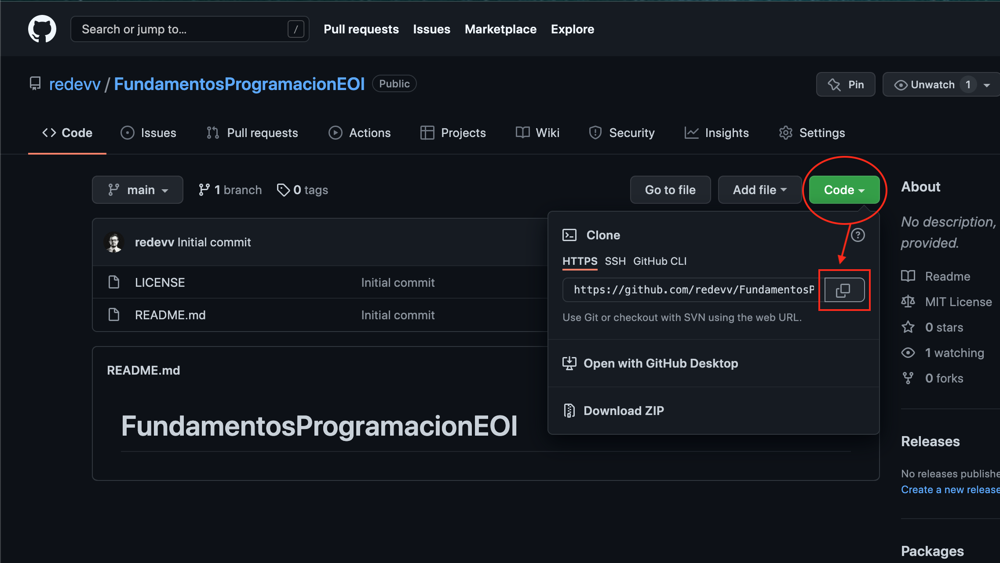

# OBJETIVOS DE LA MAÑANA (07/04/22)
## Aprender a dar formato en Markdown: 
http://fobos.inf.um.es/R/taller5j/30-markdown/guiabreve.pdf

## Crear repositorio en GitHub y seguir a compis:
```
Billy
Billy
10:08

https://github.com/BillyClassTime/FundamentosProgramacionEOI

Lina María Vásquez Salazar
Lina María Vásquez Salazar
10:08

https://github.com/Linamarv7/FundamentosProgramacionEOI

David Rey de Viñas Velázquez
David Rey de Viñas Velázquez
10:08

https://github.com/redevv/FundamentosProgramacionEOI

Iván Álamo Exposito
Iván Álamo Exposito
10:08

https://github.com/Ivanfinal/FundamentosProgramacionEOI

Francisco Vida Vílchez
Francisco Vida Vílchez
10:08

https://github.com/FranciscoVida/FundamentosProgramacionEOI

Mario Álvarez Gómez
Mario Álvarez Gómez
10:08

https://github.com/Marioalvgmz/FundamentosProgramacionEOI

Rafael Alejandro Ojeda Nicieza
Rafael Alejandro Ojeda Nicieza
10:08

https://github.com/rojeda16/fundamentosprogramacionEOI

Cristina Silván Sadoc
Cristina Silván Sadoc
10:08

https://github.com/CristinaSilvan/FundamentosProgramacionEOI

Julia Pérez Mora
Julia Pérez Mora
10:08

https://github.com/Juliafperez/FundamentosProgramacionEOI 

David González López
David González López
10:09

https://github.com/davidgl96/fundamentos-EOI

Álvaro Morales Marquez
Álvaro Morales Marquez
10:09

https://github.com/alvaromrls/FundamentosProgramacionEOI

Samuel Tirao Martos
Samuel Tirao Martos
10:09

https://github.com/TMSamuel/FundamentosProgramacionEOI

Vanessa Machordom Torres
Vanessa Machordom Torres
10:09

https://github.com/vmachord/FundamentosProgramacionEOI

Miguel Villar Zamora
Miguel Villar Zamora
10:09

https://github.com/MiguelVillarZamora/FundamentosProgramacionEOI

AMAIA SANCHIS BALLESTER
AMAIA SANCHIS BALLESTER
10:09

https://github.com/amaiasanchis/FundamentosProgramacionEOI

Juan Antonio Cejudo Algar
Juan Antonio Cejudo Algar
10:09

https://github.com/jacs2501/Curso_cloud_computing

Cynthia Martín Martínez
Cynthia Martín Martínez
10:09

https://github.com/Cynthiamm13/fundamentos/tree/main

Diego Rodriguez Sanchez
Diego Rodriguez Sanchez
10:09

https://github.com/dugalatortuga/FundamentosProgramacionEOI

PAULA CARRASCAL MARTINEZ
PAULA CARRASCAL MARTINEZ
10:09

https://github.com/pcarrascal/FundamentosProgramacionEOI

Antonio Daza Dueñas
Antonio Daza Dueñas
10:09

https://github.com/DdDaza22/FundamentosProgramacionEOI

Daniel López Doncel-Moriano
Daniel López Doncel-Moriano
10:09

https://github.com/DlopezDoncelMoriano/Fundamentos-programaci-n-EOI

Iván Salas Carrascal
Iván Salas Carrascal
10:09

https://github.com/salcarivan/salcarivan/new/main

Emiliano Julian Salvachua
Emiliano Julian Salvachua
10:10
https://github.com/emiarg10/FundamentosProgramacionEOI

Bautista Gabriel Day García
Bautista Gabriel Day García
10:10

https://github.com/bautiday/FundamentosProgramacionEOI

Jesús José Corrales Guillén
Jesús José Corrales Guillén

https://github.com/r2dn3/FundamentosProgramacionEOI
```

## Explorar Git:
1. Descargar e Instalar
2. Crear repositorio local (**SOLO PRIMERA VEZ**):

Abrimos Terminal y creamos carpeta:
```
md 00-EOI --> Se crea carpeta 00-EOI

cd --> Se cambia carpeta
rd --> Se borra carpeta
cls --> Limpiar ventana de Terminal
```
Comprobar que Git está instalado:
````
usage: git [--version] [--help] [-C <path>] [-c <name>=<value>]
           [--exec-path[=<path>]] [--html-path] [--man-path] [--info-path]
           [-p | --paginate | -P | --no-pager] [--no-replace-objects] [--bare]
           [--git-dir=<path>] [--work-tree=<path>] [--namespace=<name>]
           [--super-prefix=<path>] [--config-env=<name>=<envvar>]
           <command> [<args>]
````
Revisamos configuración global:
```
usage: git config [<options>]

Config file location
    --global              use global config file
    --system              use system config file
    --local               use repository config file
    --worktree            use per-worktree config file
    -f, --file <file>     use given config file
    --blob <blob-id>      read config from given blob object
````
````
git config --global -l
filter.lfs.clean=git-lfs clean -- %f
filter.lfs.smudge=git-lfs smudge -- %f
filter.lfs.process=git-lfs filter-process
filter.lfs.required=true
user.name=David Rey
user.email=david3991rey@gmail.com
````
Creamos repositorio local:
````
git init
Reinitialized existing Git repository in /Users/davidrey/00-EOI/.git/
````
Si no podemos ver los **archivos ocultos** en nuestra carpeta local le damos a la siguiente combinación de teclas **(solo en macOS)**:
````
command (⌘) + mayúsculas (⇧) + signo punto (.)
````

Establecemos conexión entre el repositorio local y el remoto:

````
git branch
git status
On branch master (main en GitHub)

No commits yet

Untracked files:
  (use "git add <file>..." to include in what will be committed)
	git

nothing added to commit but untracked files present (use "git add" to track)
````
Añadimos ficheros que no estaban aún:
````
git add .
git status
On branch master

No commits yet

Changes to be committed:
  (use "git rm --cached <file>..." to unstage)
	new file:   git
````
Confirmar cambios:
````
git commit -m "Estableciendo primeros pasos"
[master 201208c] Estableciendo primeros pasos
 1 file changed, 0 insertions(+), 0 deletions(-)
 create mode 100755 img/img01.pages
 ````
````
git status
On branch master
nothing to commit, working tree clean
 ````
 Copiamos enlace repositorio GitHub:

 
 
 Enlazamos repositorio local con remoto:
 ````
git remote add main https://github.com/redevv/FundamentosProgramacionEOI.git
git remote -v
main	https://github.com/redevv/FundamentosProgramacionEOI.git (fetch)
main	https://github.com/redevv/FundamentosProgramacionEOI.git (push)
git push
fatal: No configured push destination.
Either specify the URL from the command-line or configure a remote repository using

    git remote add <name> <url>

and then push using the remote name

    git push <name>

git push main
Username for 'https://github.com': redevv
Password for 'https://redevv@github.com':
Enumerating objects: 7, done.
Counting objects: 100% (7/7), done.
Delta compression using up to 8 threads
Compressing objects: 100% (4/4), done.
Writing objects: 100% (7/7), 384.51 KiB | 18.31 MiB/s, done.
Total 7 (delta 0), reused 0 (delta 0), pack-reused 0
remote: 
remote: Create a pull request for 'master' on GitHub by visiting:
remote:      https://github.com/redevv/FundamentosProgramacionEOI/pull/new/master
remote: 
To https://github.com/redevv/FundamentosProgramacionEOI.git
 * [new branch]      master -> master
 ````

## Notas:

Borrar la conexión al repositorio remoto si es necesario:

```
git remote rm main
```

Consultar qué repositorios remotos estan enlazados a nuestro repositorio local:

```
git remote -v
```

Actualizamos el repositorio remoto (GitHub):

```
git push main
```

## Bucle:

1 - Hacer las actualizaciones en los ficheros, imágenes, programas, carpetas y demás elementos de nuestro proyecto.

2 - Informar a git de los cambios:

```
c:><carpeta del proyecto> git add .
```

3 - Actualizar nuestro repositorio LOCAL o Confirmación de los cambios:

```
c:><carpeta del proyecto> git commit -m "<TEXTO CON LA OBSERVACION DE LA CONFIRMACION>"
```

4 - Actualizamos el remoto (NO LO VEREMOS EN GITHUB):

```
c:><carpeta del proyecto> git push main
```

5 - Revisar el status:

```
c:><carpeta del proyecto>git status
```


**Vuelta al punto 1**


